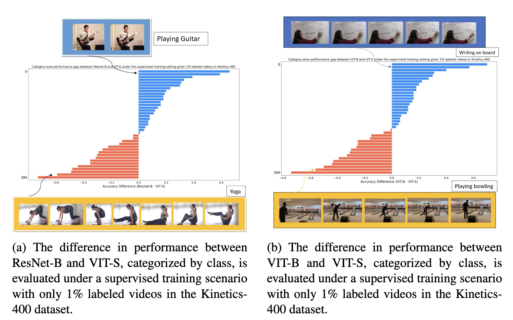
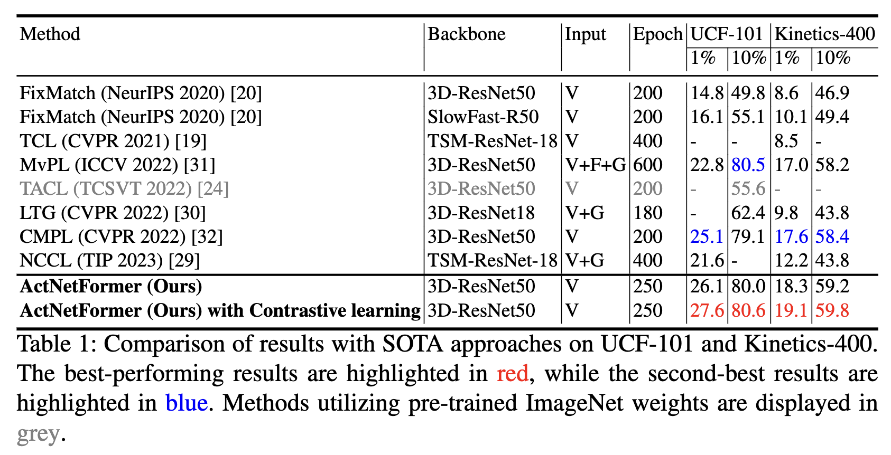

# We will release the code soon!! #

# ActNetFormer: Transformer-ResNet Hybrid Method for Semi-Supervised Action Recognition in Videos [ICPR 2024]

This page contains all the Datasets and Code bases (experiments and evaluations) involved in experimenting and establishing our newly proposed **ActNetFormer** framework for video action recognition.

The official repository of the paper with supplementary: [ActNetFormer](https://link.springer.com/chapter/10.1007/978-3-031-78354-8_22?fromPaywallRec=true) | 

## About the project

This project is a carried out in [Monash University, Malaysia campus](https://www.monash.edu.my/).

Project Members -                                                                                                                                                                                                                                                                      
[Sharana Dharshikgan Suresh Dass](https://www.linkedin.com/in/sharana-dharshikgan-suresh-dass-361167191/?originalSubdomain=my) [(Monash University, Malaysia)](https://www.monash.edu.my/)                                                                                             
[Hrishav Bakul Barua](https://www.researchgate.net/profile/Hrishav-Barua)  [(Monash University, Australia and TCS Research, Kolkata, India)](https://www.tcs.com/what-we-do/research),                                                                                                         
[Ganesh Krishnasami](https://research.monash.edu/en/persons/ganesh-krishnasamy) [(Monash University, Malaysia)](https://www.monash.edu.my/)                                                                                                                                         
[Raveendran Paramesran](https://scholar.google.com.my/citations?user=NIbyoq0AAAAJ&hl=en) [(Monash University, Malaysia)](https://www.monash.edu.my/)                                                                                                                                   
[Raphaël C.-W. Phan](https://scholar.google.com/citations?user=wR84XY1kACcC&hl=en) [(Monash University, Malaysia)](https://www.monash.edu.my/).   

This work has been accpeted in [ICPR 2024](https://icpr2024.org/).

### Funding details
This work is supported by the [`Global Research Excellence Scholarship`](https://www.monash.edu.my/student-services/financial-assistance/postgraduate-scholarships/merit-scholarships), Monash University, Malaysia. This research is also supported, in part, by the prestigious [`Global Excellence and Mobility Scholarship (GEMS)`](https://www.monash.edu.my/research/support-and-scholarships/gems-scholarship), Monash University (Malaysia & Melbourne, Australia).

## Overview
Human action or activity recognition in videos is a fundamental task in computer vision with applications in surveillance and monitoring, self-driving cars, sports analytics, human-robot interaction and many more. Traditional supervised methods require large annotated datasets for training, which are expensive and time-consuming to acquire. This work proposes a novel approach using Cross-Architecture Pseudo-Labeling with contrastive learning for semi-supervised action recognition. Our framework leverages both labeled and unlabeled data to robustly learn action representations in videos, combining pseudo-labeling with contrastive learning for effective learning from both types of samples. We introduce a novel cross-architecture approach where 3D Convolutional Neural Networks (3D CNNs) and Video Transformers (VITs) are utilized to capture different aspects of action representations hence we call it *ActNetFormer*. The 3D CNNs excel at capturing spatial features and local dependencies in the temporal domain, while VITs excel at capturing long-range dependencies across frames. By integrating these complementary architectures within the ActNetFormer framework, our approach can effectively capture both local and global contextual information of an action. This comprehensive representation learning enables the model to achieve better performance in semi-supervised action recognition tasks by leveraging the strengths of each of these architectures. Experimental results on standard action recognition datasets demonstrate that our approach performs better than the existing methods, achieving state-of-the-art performance with only a fraction of labeled data.

### Comparison of performance between different architectural models

### The components of our ActNetFormer architecture

| Components       |    Details/Link     | Structure | 
| ------------- | ------------- | ------------- |
| 3D CNN as *Primary model* | [3D-ResNet50](https://github.com/kenshohara/3D-ResNets-PyTorch), [Paper](https://ieeexplore.ieee.org/document/9008780) | Inpur: 3 × 8 × 224 x 224, Layers: 6 |
| Video Transformer (VIT) as *Auxiliary model* | VIT-S: We employ the Vision Transformer ([ViT](https://paperswithcode.com/paper/an-image-is-worth-16x16-words-transformers-1)) extended with the video [TimeSformer](https://github.com/facebookresearch/TimeSformer) as the auxiliary model in our ActNetFormer inspired by [DeiT-S](https://paperswithcode.com/paper/training-data-efficient-image-transformers)| Dimensions: 384; Heads: 6; Layers: 12 | 
| Spatial Data Augmentation| We utilize techniques in [SlowFast](https://github.com/facebookresearch/SlowFast) and [this](https://github.com/facebookresearch/video-nonlocal-net)| NA |
| Temporal Data Augmentation| We incorporate variations in frame rates for temporal data augmentations, inspired by prior research in [TCL](https://github.com/CVIR/TCL) and [VTHCL](https://github.com/decisionforce/VTHCL) | NA |
| Contrastive Learning| We use weakly augmented samples from each architecture for cross-architecture contrastive learning, inspired by [this](https://github.com/lambert-x/video-semisup), moreover the contrastive loss adapted is adopted from [SimCLR](https://github.com/google-research/simclr) and [TCL](https://cvir.github.io/TCL/)| NA |

## Our work utilizes the following:

### <ins>State-of-the-art learning models for action/activity recognition</ins>

`NeurIPS 2020` | `FixMarch` - Simplifying semi-supervised learning with consistency and confidence | [Code](https://github.com/google-research/fixmatch)

`CVPR 2021` | `TCL` - Semi-Supervised Action Recognition with Temporal Contrastive Learning | [Code](https://github.com/CVIR/TCL)

`ICCV 2022` | `MvPL` - Multiview Pseudo-Labeling for Semi-supervised Learning from Video | [Code](https://openaccess.thecvf.com/content/ICCV2021/papers/Xiong_Multiview_Pseudo-Labeling_for_Semi-Supervised_Learning_From_Video_ICCV_2021_paper.pdf)

`IEEE TCSVT 2022` | `TACL` - Semi-Supervised Action Recognition From Temporal Augmentation Using Curriculum Learning | [Code](https://ieeexplore.ieee.org/document/9904603)

`CVPR 2022` | `LTG` - Learning from Temporal Gradient for Semi-supervised Action Recognition | [Code](https://github.com/lambert-x/video-semisup)

`CVPR 2022` | `CMPL` - Cross-Model Pseudo-Labeling for Semi-Supervised Action Recognition | [Code](https://justimyhxu.github.io/projects/cmpl/)

`IEEE TIP 2023` | `NCCL` - Neighbor-guided consistent and contrastive learning for semi-supervised action recognition | [Code](https://ieeexplore.ieee.org/document/10100655)

`Elsevier NN 2023` | `DANet` - DANet: Semi-supervised differentiated auxiliaries guided network for video action recognition | [Code](https://linkinghub.elsevier.com/retrieve/pii/S0893608022004506)

### <ins>Action recognition datasets</ins>

 `Kinetics-500 2017` | Kinetics400 Dataset: The Kinetics Human Action Video Dataset | [Link](https://github.com/cvdfoundation/kinetics-dataset)

`CRCV-TR-12-01 2012` |`UCF-101` | UCF101: A Dataset of 101 Human Action Classes From Videos in The Wild | [Link](https://www.crcv.ucf.edu/data/UCF101.php) 

`ICCV 2011 ` | `HMDB51 Dataset` | HMDB: A large video database for human motion recognition | [Link](https://serre-lab.clps.brown.edu/resource/hmdb-a-large-human-motion-database/)

## Experiments and Results

For more details and experimental results please check out the paper!!

##  Citation 

If you find our work (i.e. the code, the theory/concept, or the dataset) useful for your research or development activities, please consider citing our work as follows:

~~~
@inproceedings{dass2025actnetformer,
  title={ActNetFormer: Transformer-ResNet Hybrid Method for Semi-Supervised Action Recognition in Videos},
  author={Dass, Sharana Dharshikgan Suresh and Barua, Hrishav Bakul and Krishnasamy, Ganesh and Paramesran, Raveendran and Phan, Rapha{\"e}l C-W},
  booktitle={International Conference on Pattern Recognition},
  pages={343--359},
  year={2025},
  organization={Springer}
}
~~~

## License and Copyright

~~~
----------------------------------------------------------------------------------------
Copyright 2024 | All the authors and contributors of this repository as mentioned above.
----------------------------------------------------------------------------------------

~~~

Please check the [License](LICENSE) Agreement.
