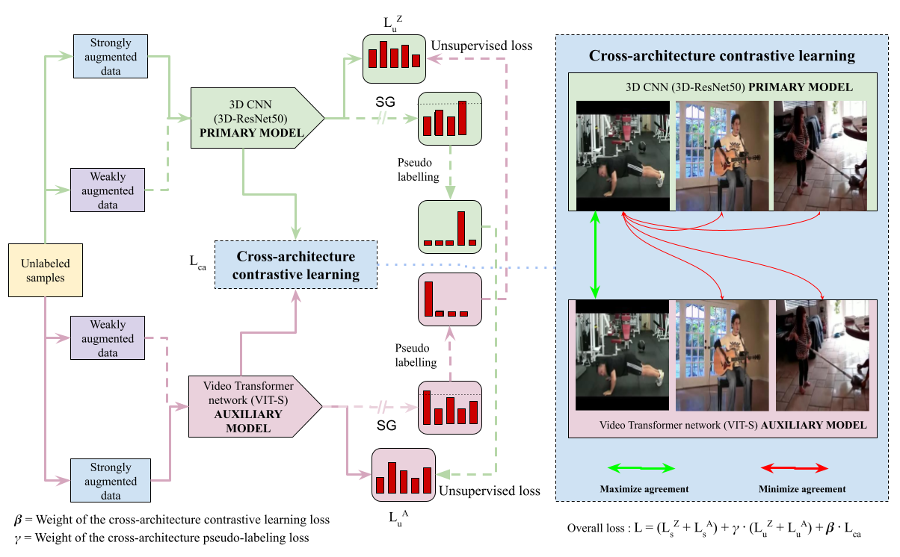
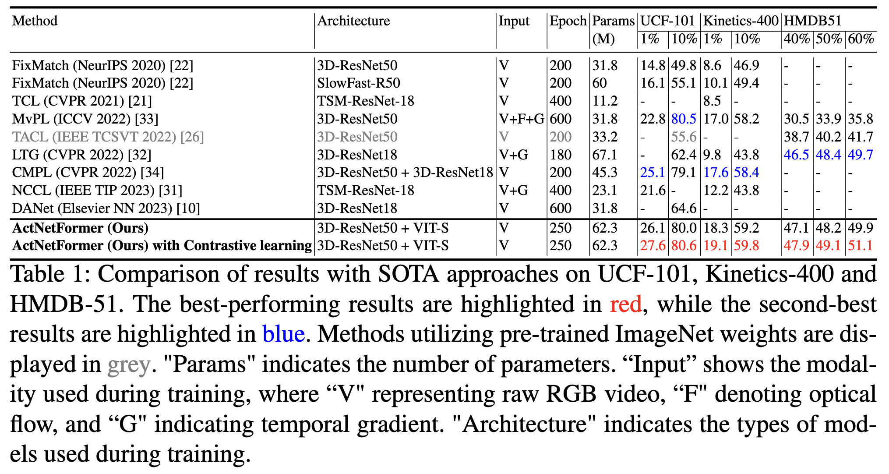

# ActNetFormer: Transformer-ResNet Hybrid Method for Semi-Supervised Action Recognition in Videos

This page contains all the Datasets and Code bases (experiments and evaluations) involved in experimenting and establishing our newly proposed **ActNetFormer** framework for video action recognition.

## About the project

This project is a carried out in [Monash University, Malaysia campus](https://www.monash.edu.my/).

Project Members -                                                                                                                                                                                                                                                                      
[Sharana Dharshikgan Suresh Dass](https://www.linkedin.com/in/sharana-dharshikgan-suresh-dass-361167191/?originalSubdomain=my) [(Monash University, Malaysia)](https://www.monash.edu.my/)                                                                                             
[Hrishav Bakul Barua](https://www.researchgate.net/profile/Hrishav-Barua)  [(Monash University and TCS Research, Kolkata, India)](https://www.tcs.com/research-and-innovation),                                                                                                         
[Ganesh Krishnasami](https://research.monash.edu/en/persons/ganesh-krishnasamy) [(Monash University, Malaysia)](https://www.monash.edu.my/)                                                                                                                                         
[Raveendran Paramesran](https://scholar.google.com.my/citations?user=NIbyoq0AAAAJ&hl=en) [(Monash University, Malaysia)](https://www.monash.edu.my/)                                                                                                                                   
[Raphaël C.-W. Phan](https://scholar.google.com/citations?user=wR84XY1kACcC&hl=en) [(Monash University, Malaysia)](https://www.monash.edu.my/).                                                                                   

### Funding details
This work is supported by the [`Global Research Excellence Scholarship`](https://www.monash.edu.my/student-services/financial-assistance/postgraduate-scholarships/merit-scholarships), Monash University, Malaysia. This research is also supported, in part, by the prestigious [`Global Excellence and Mobility Scholarship (GEMS)`](https://www.monash.edu.my/research/support-and-scholarships/gems-scholarship), Monash University (Malaysia & Australia).

## Overview
Human action or activity recognition in videos is a fundamental task in computer vision with applications in surveillance and monitoring, self-driving cars, sports analytics, human-robot interaction and many more. Traditional supervised methods require large annotated datasets for training, which are expensive and time-consuming to acquire. This work proposes a novel approach using Cross-Architecture Pseudo-Labeling with contrastive learning for semi-supervised action recognition. Our framework leverages both labeled and unlabeled data to robustly learn action representations in videos, combining pseudo-labeling with contrastive learning for effective learning from both types of samples. We introduce a novel cross-architecture approach where 3D Convolutional Neural Networks (3D CNNs) and Video Transformers (VITs) are utilized to capture different aspects of action representations hence we call it *ActNetFormer*. The 3D CNNs excel at capturing spatial features and local dependencies in the temporal domain, while VITs excel at capturing long-range dependencies across frames. By integrating these complementary architectures within the ActNetFormer framework, our approach can effectively capture both local and global contextual information of an action. This comprehensive representation learning enables the model to achieve better performance in semi-supervised action recognition tasks by leveraging the strengths of each of these architectures. Experimental results on standard action recognition datasets demonstrate that our approach performs better than the existing methods, achieving state-of-the-art performance with only a fraction of labeled data.

### Comparison of performance between different architectural models

## Our work utilizes the following:

### <ins>State-of-the-art learning models</ins>

`NeurIPS 2020` | `FixMarch` - Simplifying semi-supervised learning with consistency and confidence | [Code](https://github.com/google-research/fixmatch)

`CVPR 2021` | `TCL` - Semi-Supervised Action Recognition with Temporal Contrastive Learning | [Code](https://github.com/CVIR/TCL)

## Experiments and Results

For more details and experimental results please check out the paper!!
